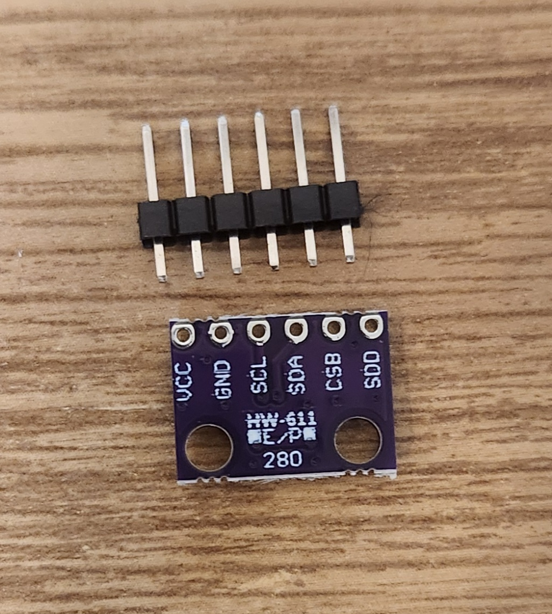
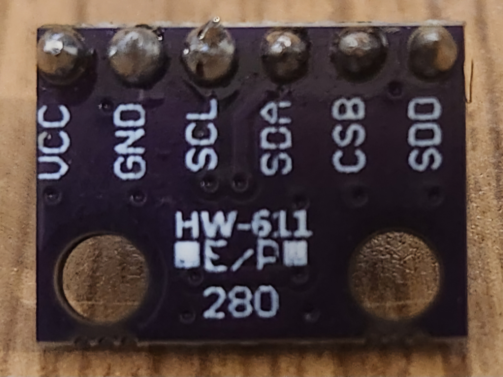
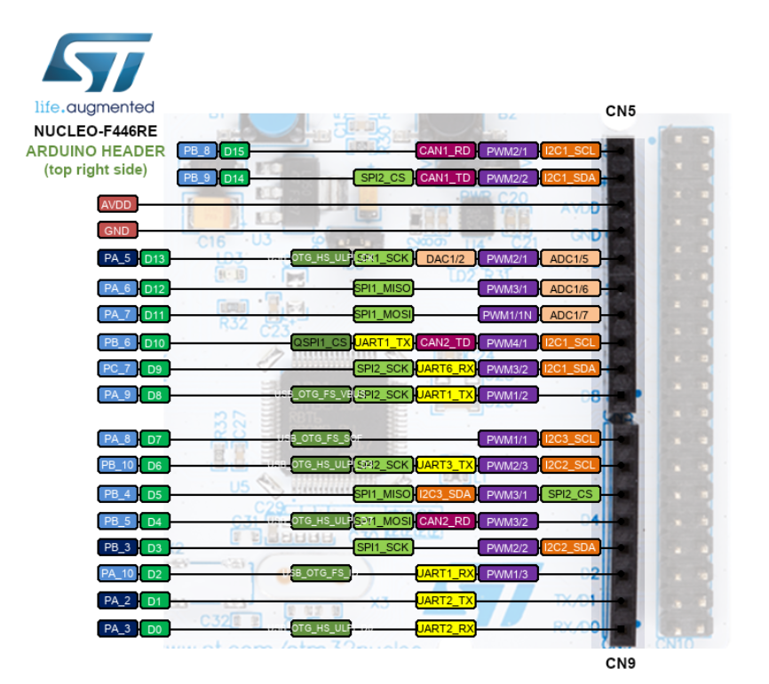
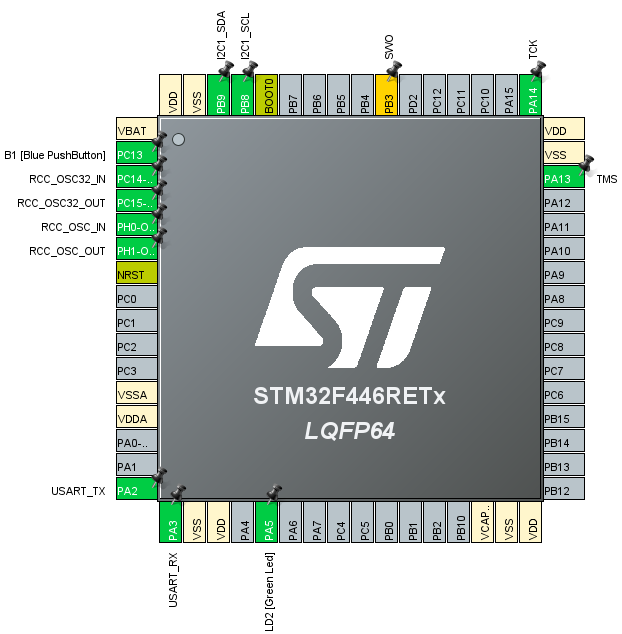
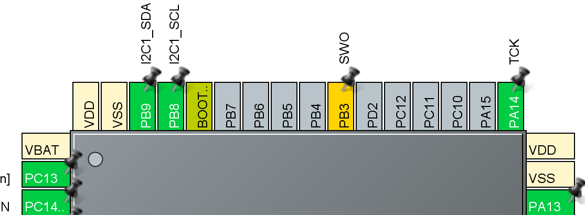

# Embedded C on STM32-Nucleo-F446RE

This is a personal project that documents my first non-academic foray into  embedded C programming. This project uses the following softwares and technologies to read temperature, pressure, and accelerometer data and display them on an LCD:

## Software
- STM32CubeIDE
- STM32CubeMX
- PuTTY

## Hardware
- STM32 Nucleo-F446RE Microcontroller
- MPU-6050 3-Axis Accelerometer Gyroscope Module
- HiLetGo USB Logic Analyzer
- HiLetgo 6 Pin SPI Micro SD TF Card Adapter Reader Module
- Nucleo LCD-1602
- HiLetgo BMP280 High Precision Atmospheric Pressure Sensor

## Step 1
After a quick "Hello World!" esque test program that made an on-board LED blink on and off with a delay, I needed to set up one of the sensors that I planned to use this project.

I decided to start with the BMP280, as it had the fewest pins and therefore seemed the simplest.

As you can see in the below image, the sensor was shipped without its header pins soldered to the board.



This would be my first attempt at soldering electroincs, so after a quick youtube tutorial, I did the best I could and now have a (remarkably) undamaged and functioning BMP280.



## Step 2
Next, I had to configure the Nucleo board using STM32CubeMX. This software is a graphical tool that helps to initialize peripherals for the STM32 microcontroller.

Using this interface, you can select different pins and configure their functionality by selecting peripherals. To start, I'll be using the I2C and USART protocals.

When a project is initialzed using a Nucleo board, many of the peripherals are defined for the user (this sets up clocks and timing diagrams that can be configured manually if someone were making their own board for the STM32 microcontroller, but the presets available for Nucleo boards abstracts this for the user).

Now that CubeMX has initialzed the board for me, I need to configure some pins that I'll be using for I2C and USART. To do this, I set PB9 and PB8 to SDA and SCL respectively.

To find what pins in CubeMX correspond to what periphals you need, this diagram from mbed's old website was useful:



This is a screenshot from CubeMX that shows the entire chip configured.



I personally configured PB8 and PB9 to use the two communications protocals I2C and USART.



Now that the pins are configured, I generate code from CubeMX. This updates all of the code in the project files that are necessary to set up my Nucleo board.

While there are many files that are generated in a project, the user code is written in `Core/Src/main.c`. In an effort to organize the code, I am writing most of my drivers for different sensors in different files. For example, I have `bmp28.c` in `Core/Src/bmp280.c` and the corresponding header file in `Core/Inc/bmp280.h`, where I include these in main.

Throughout `main.c` there are comments that show where the user can inject code. It is important to adhere to these comments, because if the pin configurations need to be changed to add or alter functionality, the project code has to be regenerated. If code is written outside of these comments, it will be erased on project generation. This is what the code looks like:

These are where you include libraries you need for your program:
```
/* USER CODE BEGIN Includes */
#include <string.h>
#include <stdio.h>
#include "bmp280.h"
/* USER CODE END Includes */
```

This is before the forever-loop that executes contineously, so any sensor initializations go here:
```
/* USER CODE BEGIN 2 */
bmp280_init(&hi2c1);
/* USER CODE END 2 */
```
This is the forever loop, so read from sensors and update display here:
```
/* USER CODE BEGIN WHILE */
while (1)
{
    bmp280_read_registers(&hi2c1, &huart2);
    bmp280_calc_temp_press();
    bmp280_print_temp(&huart2);
/* USER CODE END WHILE */

/* USER CODE BEGIN 3 */
}
/* USER CODE END 3 */
```

## References
### "If I have seen further it is by standing on the shoulders of Giants." - Isaac Newton

This [youtube tutorial by Shawn Hymel for the DigiKey youtube channel](https://www.youtube.com/watch?v=hyZS2p1tW-g&list=PLEBQazB0HUyRYuzfi4clXsKUSgorErmBv) was essential for my introduction to the STM32 workspaces.

[ST's user manual](https://www.st.com/resource/en/user_manual/um1724-stm32-nucleo32-boards-mb1180-stmicroelectronics.pdf) shows what pins are compatable with what peripherals. This website was helpful to relate things like PB_8 to I2C1_SCL and PB_9 to I2C1_SDA, which told me where to look in CubeMX for the signals I needed.

[This](https://cdn-shop.adafruit.com/datasheets/BST-BMP280-DS001-11.pdf) is the datatsheet from Bosch that describes the BMP280. It contains all the information needed to know how to access the temperature and pressure data from the memory on the sensor.